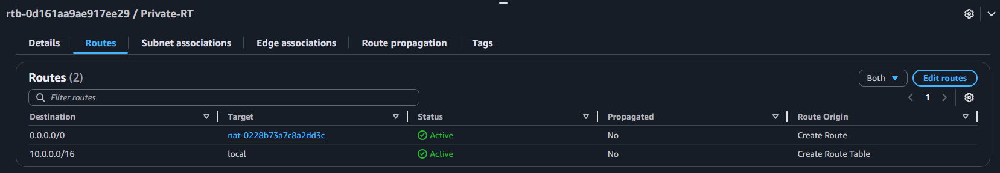
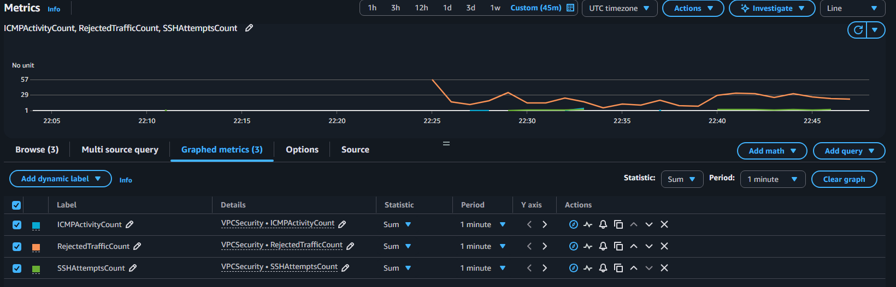

# AWS Cloud Security & Networking Project: Secure VPC Design & Intrusion Detection System

## Summary
This lab demonstrates the deployment and configuration of a secure, multi-tier AWS network architecture with an integration intrusion detection system (IDS). The primary goal was to build hands on experience in AWS networking, security groups, network ACLs, bastion host configuration, VPC Flow Logs, and CloudWatch monitoring, while showcasing practical cloud security skills relevant for cloud engineering and cybersecurity roles.

### Lab Architecture


- VPC with public and private subnets.
- Bastion Host in public subnet for secure SSH access to private instances.
- NAT Gateway to allow outbound Internet access from private subnet. 
- Private Application Server in private subnet.
- Security Controls:
   - Security Groups(SG)
   - Network ACLs(NACL)
   - VPC Flow Logs for monitoring traffic
- CloudWatch Metrics & Alarms to detect suspicious activity.

### Part 1: VPC and Subnet Configuration
- Created a VPC with CIDR ```10.0.0.0/16```.
- Configured public (10.0.1.0/24) and private (10.0.2.0/24) subnets.
- Deployed Internet Gateway for public subnet connectivity.
- Created and configured public route table, that routes traffic to the internet gateway.
  
- Created and configured private route table. 


### Part 2: Bastion Host Deployment
- Launched an EC2 instance with Amazon Linux 2023 AMI in the public subnet.
- Configured key based SSH access.
- Updated bastion host security group to allow inbound SSH from my local ip.
  
- Verified connectivity with local machine via SSH.
   - Used this ssh command:```ssh -i "C:\Users\jarre\Downloads\key.pem" ec2-user@<Bastion_Public_IP>```
   

### Part 3: Private App Server Deployment
- Launched an EC2 instance with Amazon Linux 2023 AMI in the private subnet.
- Configured Private App Server security group to allow inbound SSH from Bastion Host SG.
  
- Since I used the same key pair for this EC2 as the Bastion Host, I need to copy the private key to this machine.
  - Used this command:```scp -i "C:\Users\jarre\Downloads\key.pem" C:\Users\jarre\Downloads\ey.pem ec2-user@<Bastion_Public_IP>:~/```
- Verified connectivity with Bastion Host.
  - Used this ssh command:```ssh -i ~/key.pem ec2-user@<Private_App_Server_Private_IP>```
  

### Part 4: Configure NAT Gateway 
- Deployed NAT Gateway in public subnet for outbound internet acces from private subnet.
- Allocated Elastic IP to to NAT Gateway.
- Updated private route table to route outbound traffic through NAT Gateway.

- Verified outboud connectivity from the Private App Server.
  - Used this ping command: ```ping -c 3 google.com```
  

### Part 5: Configure Network ACLs
- Create Public and Private subnet NACLs and associate them with the correct subnet.
- PublicSubnet-NACL:
    - Allow inbound SSH traffic from my local ip.
    - Allow inbound HTTP/HTTPS traffic from any ip.
    - Allow any inbound traffic from private subnet CIDR.
    
    - Allow all outbound traffic.
    
- PrivateSubnet-NACL:
    - Allow inbound SSH traffic from public subnet CIDR.
    - Allow inbound HTTP traffic from public subnet CIDR.
    - Allow inbound ICMP traffic from any ip.
    
    - Allow outbound traffic from ephemeral ports 1024-65535.
    - Allow outbound ICMP traffic from any ip.
    

### Part 6: Enable GuardDuty
- Create Flow Log and confiure it to accept all traffic.
- Create new VPC-Flow-Logs, log group.
- Enable Amazon GuardDuty.
- After ~10-15 min. findings should be visible in the GuardDuty findings tab.


### Part 7: Configure CloudWatch/Metrics
- Send Flow Logs to CloudWatch logs.
- Created Metrics Filters:
  - Rejected Traffic (Deny Events): Which detects blocked inbound/outbound connections.
     - Metric Filter Pattern:```[version, account, interface, srcaddr, dstaddr, srcport, dstport, protocol, packets, bytes, start, end, action="REJECT", status]```
  - SSH Attempts from Unapporved Sources: Flags external SSH attmepts(SSH attempts outside of Bastion).
     - Metric Filter Pattern:```[version, account, interface, srcaddr, dstaddr, srcport, dstport=22, protocol=6, packets, bytes, start, end, action="ACCEPT", status]```
  - High Traffic Volume: Detect potential exfiltration of scanning.
     - Metric Filter Pattern:```[version, account, interface, srcaddr, dstaddr, srcport, dstport, protocol, packets>1000, bytes, start, end, action="ACCEPT", status]```
  - ICMP Activity: Monitor unexpected ping traffic.
     - Metric Filter Pattern:```[version, account, interface, srcaddr, dstaddr, srcport, dstport, protocol=1, packets, bytes, start, end, action="ACCEPT", status]```



### Part 8: Create CloudWatch Alarms
- Configure CloudWatch Alarms on each custom metric.
- Integrated with SNS topic to receive real-time alerts for suspicious activity.
- Test alarms by generating simulated attack traffic.
  - Failed SSH attempts.
  - Pinging private server.
  - Connecting to blocked ports.
- To test the alarm works, I tried to ssh into the bastion host using the wrong key an excessive amoutn of times. I received this email alert ~5 min. later.


## Lab Outcome
- Successfully deplyed multi-tier AWS network with secure internal and external connectivity.
- Implemented intrusion detection capabilities using flow logs, metric filters, and CloudWatch alarms.
- Validated the effectivness of security controls by testing diffrent attack vectors in a controlled environment.
### Key Skills Highlighted
- AWS VPC, EC2, Security Groups, NACLs, NAT Gateway
- CloudWatch Metrics & Alarms
- Network security monitoring and IDS implementation
- SSH & Bastion Host configuration
- Hands on logging and troubleshooting in AWS


